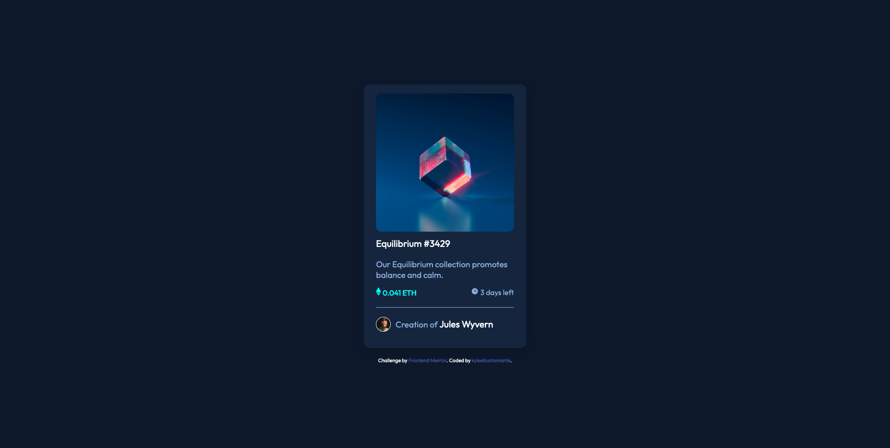

# Frontend Mentor - NFT preview card component solution

This is a solution to the [NFT preview card component challenge on Frontend Mentor](https://www.frontendmentor.io/challenges/nft-preview-card-component-SbdUL_w0U). Frontend Mentor challenges help you improve your coding skills by building realistic projects. 

## Author
If you use my solution to help you with completing your challenge, I'd love a virtual pat on the back by including me in your acknowledgements! 
- Frontend Mentor - [@kyleebustamante](https://www.frontendmentor.io/profile/kyleebustamante)
- GitHub [https://github.com/kyleebustamante](https://github.com/kyleebustamante)

## Table of contents

- [Overview](#overview)
  - [The challenge](#the-challenge)
  - [Screenshot](#screenshot)
  - [Links](#links)
  - [Built with](#built-with)
  - [Useful resources](#useful-resources)

## Overview

### The challenge

Users should be able to:

- View the optimal layout depending on their device's screen size
- See hover states for interactive elements

### Screenshot

### Links

- Solution URL: [https://github.com/kyleebustamante/nft-preview-frontend-mentor](https://github.com/kyleebustamante/nft-preview-frontend-mentor)
- Live Site URL: [https://reliable-pie-8e597d.netlify.app/](https://reliable-pie-8e597d.netlify.app/)

### Built with

- HTML
- CSS 

### Useful resources

- [Resource 1](https://www.w3schools.com/howto/howto_css_image_overlay.asp) - I had a difficult time with the hover overlay on the image and found these examples very helpful!
